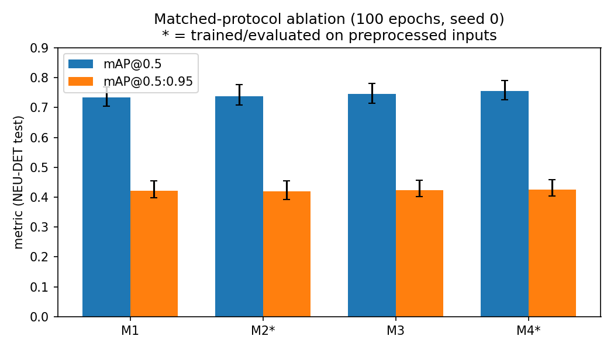
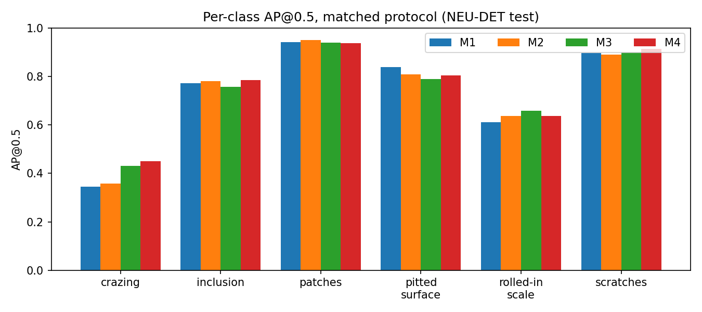
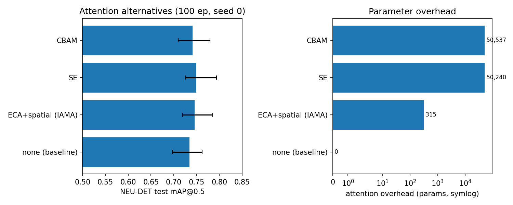
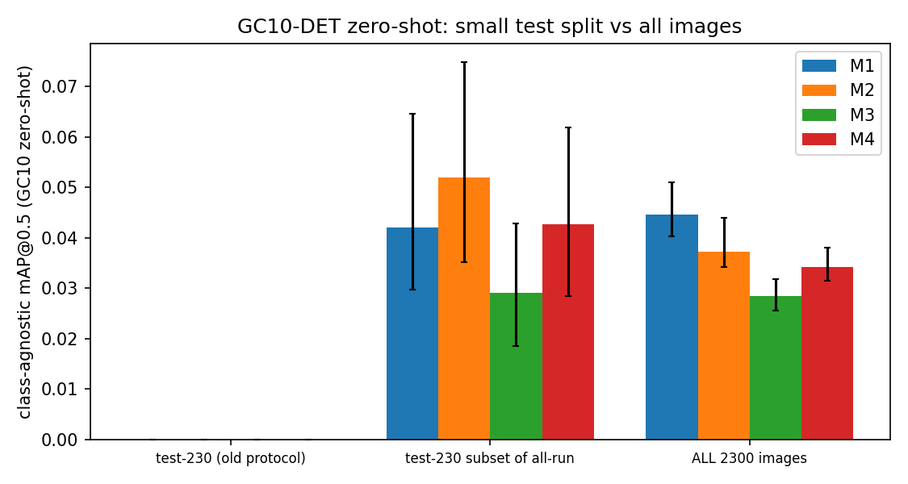
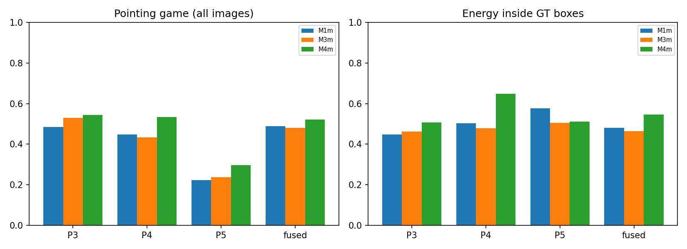

# Illumination Normalisation and Lightweight Attention for Steel Surface Defect Detection: An Audited Empirical Study of a YOLO11s Variant ("IAMA-Net")

**Version 3 (2026-10-06). This document supersedes `results/IAMA_Net_Academic_Research_Report.md`.**
Every numeric table below is generated by `scripts_v3/make_report_tables.py` from evaluation CSVs in
`results_v3/` (produced by the scripts named in each caption). The audit of the previous version is
`results_v3/audit/audit_report.md`; per-number changes are listed in `results_v3/CHANGELOG.md`.

## Abstract

We re-examine "IAMA-Net", a YOLOv11s variant for steel surface defect detection combining
(a) CLAHE + bilateral-filter "illumination normalisation" and (b) ECA channel attention with
CBAM-style spatial attention at P3/P4/P5, evaluated on NEU-DET with zero-shot class-agnostic
transfer to GC10-DET. An external review found that the original study's ablation was confounded
(models fine-tuned from a converged baseline with frozen backbones and unequal budgets), its
class-wise table came from the wrong checkpoint, and its headline transfer gain rested on 10% of
the target dataset. We rebuilt the environment, re-derived every reported number from the original
checkpoints, and re-ran the full ablation under a matched protocol (identical COCO-pretrained
initialisation, hyperparameters, augmentation, and 100-epoch budget; single seed). Under the
matched protocol the picture reverses in part and sharpens in part: the full model improves
NEU-DET mAP@0.5 over the baseline by roughly +2 pp (paired image bootstrap p=0.038) with
mAP@0.5:0.95 inconclusive; the gain is concentrated in the hardest class (crazing, ≈ +10 pp) and
is not specific to the chosen attention modules (SE matches or exceeds them); the preprocessing
component shows no measurable in-domain benefit and measurably harms zero-shot transfer; and
zero-shot transfer to GC10-DET is near-zero for every variant, with modified models transferring
significantly worse than the baseline on all 2,300 images. The previously reported "+49.8%
relative transfer gain" and the per-class "regressions" are both shown to be protocol artifacts.
All variants run above 55 FPS (batch 1, fp32) on a 4 GB laptop GPU. Results are reported with
95% bootstrap confidence intervals and paired tests; the single-seed limitation is stated
explicitly throughout.

## 1. Introduction

Steel surface defect detection is a standard benchmark problem for industrial vision. The
original project asked whether "illumination-aware" preprocessing plus multi-scale lightweight
attention improves a YOLO11s detector in-domain (NEU-DET) and under cross-dataset shift
(GC10-DET). After an external review identified serious methodological flaws, the contribution
was reframed as an **empirical study**:

> Does illumination normalisation plus lightweight attention help YOLO-based steel defect
> detection — in-domain, and under cross-dataset shift — when the comparison is run under a
> matched protocol with uncertainty quantification?

This document reports (i) a forensic audit of the original claims and checkpoints (Section 4),
(ii) the matched-protocol ablation with confidence intervals and paired tests (Section 5.1),
(iii) controls for the two interventions — alternative attention modules and corrected
preprocessing variants (Sections 5.2–5.3), (iv) a whole-dataset zero-shot transfer evaluation
with explicit confound controls (Section 5.4), and (v) efficiency and quantified interpretability
measurements (Sections 5.5–5.6). Negative and inconclusive results are reported as such.

## 2. Related work

**Steel defect detection.** NEU-DET (Song & Yan, 2013) [6] and GC10-DET (Lv et al.; see
reference note [11]) are the two standard benchmarks. Recent detection work on these datasets
is dominated by YOLO-family modifications; e.g. Yasir & Ahn (2023) [9] improve YOLOv5 with
depthwise convolutions and channel shuffling on NEU-DET/GC10-DET, and Sun et al. (2025) [8]
propose a gamma-correction state-space model evaluated on both.

**Attention modules.** Squeeze-and-Excitation [3], CBAM [2], ECA [1] and Coordinate Attention [4]
are standard lightweight add-ons; ECA achieves channel attention with a 1-D convolution over
pooled channel statistics (a handful of parameters). Inserting such modules into YOLO backbones/
necks for defect detection is common practice in the 2022–2025 literature [8,9]; this project
therefore makes **no novelty claim** for the attention architecture itself.

**Illumination/contrast preprocessing.** CLAHE [12] and bilateral filtering [7] are classical
contrast-enhancement/denoising tools and appear inside many YOLO pipelines for industrial
inspection. Section 5.3 evaluates whether they help a modern detector at all — on grayscale
input, which makes the original "decouple chromaticity in CIE L\*a\*b\*" rationale inapplicable
(both datasets are grayscale; see Section 3.3).

**Cross-dataset evaluation.** Zero-shot, class-agnostic evaluation on a second plant/dataset is
less standardised than in-domain benchmarking; we are not aware of a canonical protocol for
NEU-DET→GC10-DET. Our contribution here is methodological: whole-dataset scope, documented
class-mapping restrictions, resolution/scale controls, and uncertainty quantification.

## 3. Method

### 3.1 Architecture

Baseline: stock YOLOv11s (`configs/yolo11s_baseline.yaml`, nc=6). Attention variant ("IAMA"):
`ECA_SpatialAttn` blocks inserted after the neck outputs P3/P4/P5 (`configs/yolo11s_iama.yaml`,
layers 5/8/13). Each block is ECA (Conv1d(1,1,k), adaptive k) followed by CBAM-style spatial
attention (Conv2d(2→1, 7×7) over concat(channel-mean, channel-max), sigmoid gate). Gates are
identity-initialised (zero weights, +4.0 bias → cascade scale σ(4)² ≈ 0.964).

Recounted from the actual checkpoints (`scripts_v3/count_params.py`):

| model | params (unfused) | params (fused) | attention params | ECA kernel sizes |
|---|---|---|---|---|
| yaml_baseline | 9,430,114 | 9,415,122 | 0 | [] |
| yaml_iama | 9,430,429 | 9,415,437 | 315 | [5, 5, 5] |
| ckpt_M1 | 9,430,114 | 9,415,122 | 0 | [] |
| ckpt_M2 | 9,430,114 | 9,415,122 | 0 | [] |
| ckpt_M3 | 9,430,429 | 9,415,437 | 315 | [5, 5, 5] |
| ckpt_M4 | 9,430,429 | 9,415,437 | 315 | [5, 5, 5] |
| ckpt_ANCHOR | 9,430,429 | 9,415,437 | 315 | [5, 5, 5] |

Corrections vs the old report: the attention overhead is **315** parameters (the abstract's 309
matches a k=3 assumption; actual ECA kernels are k=5 at all three insertions because the yaml
passes unscaled `channels=512` to every block). Actual input channels at P3/P4/P5 are
**256/256/512** (not 128/256/512). The old report's baseline count 9,415,122 is the
BN-**fused** count; unfused it is 9,430,114.

**Reproducibility note.** The original training environment patched ultralytics site-packages to
register `ECA_SpatialAttn`; that patched class was lost with the venv. The checkpoints store the
spatial gate as a raw `nn.Conv2d` named `spatial_conv`, which does not match the repository's
`models/attention.py` (wrapper module named `spatial`). We reconstructed a structurally identical
class (`scripts_v3/iama_env.py`); the reconstruction is validated by exactly reproducing the
originally reported metrics of the affected checkpoints (Section 4).

### 3.2 Preprocessing variants

- **PP-original ("LAB+bilateral")**: CLAHE (clipLimit 2.0, 8×8 tiles, OpenCV semantics: the clip
  limit is a multiplier of the mean histogram-bin height) on the L\* channel of a BGR↔LAB round
  trip, then `bilateralFilter(d=5, σ_color=σ_space=50)`. Parameter identity was verified by
  re-applying candidates to raw images and comparing against the stored cache
  (`results_v3/audit/preprocessing_param_id.csv`: MAE 1.47 vs ≥4.79 for all alternatives —
  residual error is JPEG re-encoding noise).
- **PP-gray (control, Section 5.3)**: CLAHE (clip 2.0, 8×8) directly on the single grayscale
  channel; no LAB round trip; no bilateral filter.

Both datasets are grayscale. The LAB round trip is therefore not motivated by chromaticity; it is
also measurably lossy: after conversion, 308 of 1,797 preprocessed NEU images no
longer have identical BGR channels (chroma noise introduced by the round trip + JPEG coding;
`results_v3/audit/data_audit_summary.json`).

### 3.3 Datasets

| dataset | split | images | boxes | size (px) | channels |
|---|---|---|---|---|---|
| NEU-DET | train | 1257 | 2918 | 200x200 | 3ch-identical(grayscale-stored-as-BGR) |
| NEU-DET | val | 270 | 647 | 200x200 | 3ch-identical(grayscale-stored-as-BGR) |
| NEU-DET | test | 270 | 612 | 200x200 | 3ch-identical(grayscale-stored-as-BGR) |
| NEU-DET_preprocessed | train | 1257 | 2918 | 200x200 | 3ch-identical(grayscale-stored-as-BGR), 3ch-color |
| NEU-DET_preprocessed | val | 270 | 647 | 200x200 | 3ch-identical(grayscale-stored-as-BGR), 3ch-color |
| NEU-DET_preprocessed | test | 270 | 612 | 200x200 | 3ch-identical(grayscale-stored-as-BGR), 3ch-color |
| GC10-DET | train | 1840 | 2848 | 2048x1000 | 1ch |
| GC10-DET | val | 230 | 349 | 2048x1000 | 1ch |
| GC10-DET | test | 230 | 366 | 2048x1000 | 1ch |

GC10-DET box counts cross-checked against the dataset's own `metadata.jsonl` annotations:

| scope | boxes |
|---|---|
| total | 3563 |
| train | 2848 |
| val | 349 |
| test | 366 |
| per class | crease=74; crescent_gap=265; inclusion=347; oil_spot=569; punching_hole=329; rolled_pit=85; silk_spot=884; waist_folding=143; water_spot=354; welding_line=513 |

Corrections vs the old report: GC10-DET locally comprises **2,300 images** (the "2,303" counted
three `metadata.jsonl` files) with **3,563 boxes**; its 10th class is `rolled_pit`, not
"rolled-in scale"; NEU-DET images are 200×200 (not "high-resolution"). Split integrity was
audited (SHA-256 of file bytes and decoded pixels): **no duplicates and no train/val/test
leakage** in either dataset (`scripts_v3/audit_data.py`).

### 3.4 Training protocols

**Old (confounded) protocol** — recorded from `runs/*/args.yaml`:

| run | epochs | init | optimiser / lr0 | cos LR | warmup | close_mosaic | frozen layers | data |
|---|---|---|---|---|---|---|---|---|
| M1 | 100 | yaml + COCO transfer | auto / 0.01 | no | 3.0 | 10 | none | raw |
| M2 | 25 | **M1 best.pt** | AdamW / 0.0008 | yes | 1.0 | 0 | none | preprocessed |
| M3 | 25 | **identity-mapped M1 best** | AdamW / 0.0008 | yes | 1.0 | 0 | **10 backbone layers** | raw |
| M4 | 30 | **identity-mapped M1 best** | AdamW / 0.0008 | yes | 1.0 | 0 | **10 backbone layers** | preprocessed |

The old report's claim that all models were trained "under identical hyperparameters" is false
(see audit §9). M2–M4 are short fine-tunes of the converged M1 — with a frozen backbone for the
attention variants — so their deltas conflate the interventions with fine-tuning dynamics.
Evidence that this mattered: the *identity-mapped anchor* (M1 weights ported into the attention
architecture with pass-through gates, i.e. functionally ≈ M1) scored **higher** than every
trained variant on the NEU test split (0.7608 vs 0.7527/0.7444/0.7484/0.7333).

**Matched protocol (this study)** — `scripts_v3/train_matched.py`, one run per variant, seed 0,
100 epochs, all variants from the same COCO-pretrained YOLO11s (`yolo11s.pt`; attention variants
via aligned semantic layer mapping, 493/499 tensors transferred — the 6 skipped are the
nc-mismatched Detect class convolutions; manifest: `runs_v3/init/iama_coco_mapped_init.manifest.json`;
identity attention init preserved). AdamW lr0=8e-4, lrf=0.01, wd=5e-4, cosine schedule,
warmup 1 epoch, close_mosaic=0, batch 8 (accumulate 2 via nbs=16), imgsz 640, workers 2,
deterministic=True, no freezing, identical augmentation (ultralytics defaults, pinned in the
manifest). Hardware: RTX 3050 Laptop 4 GB, Windows 11, torch 2.11.0+cu128, ultralytics 8.3.40.
Per-run manifests (command, seed, git commit, epochs, timings): `runs_v3/*_matched_seed0/manifest.json`.
Measured cost ≈ 62–87 min per 100-epoch run.

Variants: **M1** baseline/raw, **M2** baseline/PP-original, **M3** IAMA/raw, **M4** IAMA/PP-original
(Phase 2); **M3se**, **M3cbam** (SE / CBAM at the same three insertion points, same identity-init
principle, raw inputs) and **M2gray** (baseline arch, PP-gray) as Phase 3 controls.

**Limitation (user-directed):** a single seed per variant. Between-seed variance cannot be
estimated; all uncertainty statements are image-level bootstrap CIs conditional on these runs.

### 3.5 Evaluation protocols

All evaluation uses ultralytics `val()` semantics (rect letterboxing, conf=0.001, NMS IoU=0.7,
imgsz=640, max_det=300), each model evaluated on the input distribution it was trained on, plus
explicit cross-distribution diagnostics. Per-image detections are cached
(`val(save_json=True)` → JSONL) and re-scored by an independent COCO-style implementation
(`scripts_v3/metrics_lib.py`) that reproduces ultralytics mAP exactly (Δ ≤ 0.0001 on NEU).

- **NEU-DET**: test split (270 images, 612 boxes); macro mAP@0.5, mAP@0.5:0.95, per-class AP,
  mean P/R at the max-mean-F1 confidence.
- **GC10-DET zero-shot**: class-agnostic (single_cls: all predictions merged, cross-class NMS,
  all GT collapsed), on **all 2,300 images** (primary) and the 230-image test split (for
  reconciliation with the old protocol).
- **Restricted-overlap protocol**: predictions restricted to NEU {inclusion, pitted_surface,
  rolled-in_scale} vs GT restricted to GC10 {inclusion, rolled_pit}, collapsed to one class
  (mapping fixed before evaluation and justified in `scripts_v3/gc10_restricted_overlap.py`).
- **Uncertainty**: 95% percentile CIs from 1,000 image-level bootstrap resamples (seed 20261005);
  paired bootstrap (same resampled images for both models) for variant-vs-baseline deltas,
  two-sided p = 2·min(P(Δ≤0), P(Δ≥0)). "Significant" is used only where the paired CI excludes 0.
- **FPS**: batch 1, 50 warm-up + 300 timed iterations × 5 repeats, fp32/fp16 separately, real
  test image and random-noise input, preprocessing/inference/NMS split, GPU clocks and
  temperature logged (`scripts_v3/fps_bench.py`, `gpu_state.csv` files).
- **Grad-CAM quantification**: gradient-weighted CAM (target = highest pre-NMS anchor class
  score) at P3/P4/P5 and fused, on the whole NEU test split; pointing game (argmax inside any GT
  box; unconditional and conditional on a TP detection at conf ≥ 0.25) and energy-in-GT-box,
  with image-bootstrap CIs (`scripts_v3/gradcam_quant.py`).

## 4. Audit of the original report

Full detail: `results_v3/audit/audit_report.md` (generator: `scripts_v3/make_audit_report.py`).
Summary of findings:

1. **Master-table mAP@0.5 values are genuine**: all reproduce within ±0.0002 from the original
   checkpoints under a fixed protocol; batch-size sensitivity is ≤ 0.0002
   (`results_v3/audit/val_batch_sensitivity.csv`).
2. **The class-wise table was computed from the wrong checkpoint**: the report's "M1" column
   matches the identity-mapped anchor (total |deviation| 0.0019) and not M1 (0.0646). The
   M2/M3/M4 class columns do not match their own checkpoints either (max per-class deviation
   0.10–0.14). The headline claim "inclusion 78.1 → 87.8 (+9.7 pp)" is **not reproducible from
   any checkpoint in the repository**: recomputed inclusion AP50 spans 0.782–0.788 across all
   five original models.

| model | metric | old reported | new val() | Δ(new−old) |
|---|---|---|---|---|
| M1 | mAP@0.5 | 0.7527 | 0.7527 | 0.0000 |
| M1 | mAP@0.5:0.95 | — | 0.4202 | — |
| M1 | precision | 0.7101 | 0.7099 | -0.0002 |
| M1 | recall | 0.6898 | 0.6896 | -0.0002 |
| M2 | mAP@0.5 | 0.7444 | 0.7444 | 0.0000 |
| M2 | mAP@0.5:0.95 | — | 0.4275 | — |
| M2 | precision | 0.6912 | 0.6910 | -0.0002 |
| M2 | recall | 0.6924 | 0.6924 | -0.0000 |
| M3 | mAP@0.5 | 0.7484 | 0.7484 | 0.0000 |
| M3 | mAP@0.5:0.95 | — | 0.4254 | — |
| M3 | precision | 0.6721 | 0.6729 | 0.0008 |
| M3 | recall | 0.7082 | 0.7082 | -0.0000 |
| M4 | mAP@0.5 | 0.7333 | 0.7333 | -0.0000 |
| M4 | mAP@0.5:0.95 | — | 0.4058 | — |
| M4 | precision | 0.6686 | 0.6704 | 0.0018 |
| M4 | recall | 0.6815 | 0.6835 | 0.0020 |
| ANCHOR | mAP@0.5 | 0.7608 | 0.7607 | -0.0001 |
| ANCHOR | mAP@0.5:0.95 | — | 0.4185 | — |
| ANCHOR | precision | 0.7114 | 0.7115 | 0.0001 |
| ANCHOR | recall | 0.6907 | 0.6907 | 0.0000 |

| class | rep M1 | new M1 | new ANCHOR | rep M2 | new M2 | rep M3 | new M3 | rep M4 | new M4 |
|---|---|---|---|---|---|---|---|---|---|
| crazing | 0.49 | 0.449 | 0.489 | 0.412 | 0.393 | 0.434 | 0.420 | 0.386 | 0.397 |
| inclusion | 0.781 | 0.782 | 0.781 | 0.866 | 0.787 | 0.878 | 0.788 | 0.865 | 0.784 |
| patches | 0.944 | 0.946 | 0.944 | 0.791 | 0.926 | 0.813 | 0.943 | 0.812 | 0.915 |
| pitted_surface | 0.803 | 0.808 | 0.803 | 0.814 | 0.811 | 0.831 | 0.839 | 0.813 | 0.796 |
| rolled-in_scale | 0.658 | 0.643 | 0.658 | 0.602 | 0.666 | 0.583 | 0.640 | 0.569 | 0.631 |
| scratches | 0.889 | 0.888 | 0.889 | 0.918 | 0.884 | 0.926 | 0.860 | 0.931 | 0.876 |
| MEAN | 0.7608 | 0.753 | 0.761 | 0.7338 | 0.744 | 0.7442 | 0.748 | 0.7293 | 0.733 |

3. **mAP@0.5:0.95 column has no CSV provenance** in the repo and does not reproduce
   (e.g. M2: reported 0.4070 vs recomputed 0.4275).
4. **Parameter overhead is 315, not 309**; ECA kernels are k=5; P3/P4 are 256-channel
   (Section 3.1).
5. **Dataset facts corrected** (Section 3.3), including rolled_pit as GC10's 10th class and
   2,300/3,563 image/box counts; the LAB route injects chroma noise into grayscale data.
6. **FPS numbers are not reproducible** under a controlled protocol; the old 43.5–59.5 spread
   between variants overstates architecture costs (Section 5.5).
7. **The ablation was confounded** (Section 3.4), and the "+49.8% transfer gain" relied on the
   230-image test split: on all 2,300 zero-shot images the original M4−M1 difference is
   +0.32 pp with a CI spanning zero (p=0.17; `results_v3/audit/paired_bootstrap_m4_vs_m1.csv`).
   Original-model re-evaluation with CIs:

| model | dataset | inputs | scope | metric | point | 95% CI |
|---|---|---|---|---|---|---|
| M1 | neu | raw | all | mAP@0.5 | 0.7527 | [0.7210, 0.7879] |
| M1 | neu | raw | all | mAP@0.5:0.95 | 0.4202 | [0.3962, 0.4553] |
| M2 | neu | pp | all | mAP@0.5 | 0.7444 | [0.7152, 0.7826] |
| M2 | neu | pp | all | mAP@0.5:0.95 | 0.4275 | [0.4047, 0.4616] |
| M3 | neu | raw | all | mAP@0.5 | 0.7484 | [0.7167, 0.7855] |
| M3 | neu | raw | all | mAP@0.5:0.95 | 0.4254 | [0.4013, 0.4603] |
| M4 | neu | pp | all | mAP@0.5 | 0.7333 | [0.7032, 0.7712] |
| M4 | neu | pp | all | mAP@0.5:0.95 | 0.4058 | [0.3824, 0.4394] |
| ANCHOR | neu | raw | all | mAP@0.5 | 0.7607 | [0.7279, 0.7960] |
| ANCHOR | neu | raw | all | mAP@0.5:0.95 | 0.4185 | [0.3962, 0.4539] |
| M2 | neu | raw | all | mAP@0.5 | 0.5407 | [0.5099, 0.5819] |
| M2 | neu | raw | all | mAP@0.5:0.95 | 0.2875 | [0.2697, 0.3182] |
| M4 | neu | raw | all | mAP@0.5 | 0.5563 | [0.5264, 0.5939] |
| M4 | neu | raw | all | mAP@0.5:0.95 | 0.2949 | [0.2755, 0.3257] |
| M1 | gc10 | raw | all | mAP@0.5 | 0.0380 | [0.0343, 0.0439] |
| M1 | gc10 | raw | all | mAP@0.5:0.95 | 0.0124 | [0.0108, 0.0149] |
| M2 | gc10 | raw | all | mAP@0.5 | 0.0312 | [0.0253, 0.0345] |
| M2 | gc10 | raw | all | mAP@0.5:0.95 | 0.0101 | [0.0075, 0.0115] |
| M3 | gc10 | raw | all | mAP@0.5 | 0.0382 | [0.0320, 0.0461] |
| M3 | gc10 | raw | all | mAP@0.5:0.95 | 0.0113 | [0.0097, 0.0139] |
| M4 | gc10 | raw | all | mAP@0.5 | 0.0413 | [0.0361, 0.0501] |
| M4 | gc10 | raw | all | mAP@0.5:0.95 | 0.0123 | [0.0101, 0.0143] |
| ANCHOR | gc10 | raw | all | mAP@0.5 | 0.0402 | [0.0361, 0.0455] |
| ANCHOR | gc10 | raw | all | mAP@0.5:0.95 | 0.0135 | [0.0115, 0.0158] |
| M2 | gc10 | pp | all | mAP@0.5 | 0.0373 | [0.0333, 0.0431] |
| M2 | gc10 | pp | all | mAP@0.5:0.95 | 0.0118 | [0.0102, 0.0139] |
| M4 | gc10 | pp | all | mAP@0.5 | 0.0449 | [0.0395, 0.0540] |
| M4 | gc10 | pp | all | mAP@0.5:0.95 | 0.0139 | [0.0120, 0.0165] |
| M1 | gc10 | raw | test | mAP@0.5 | 0.0313 | [0.0200, 0.0498] |
| M1 | gc10 | raw | test | mAP@0.5:0.95 | 0.0096 | [0.0057, 0.0165] |
| M2 | gc10 | raw | test | mAP@0.5 | 0.0282 | [0.0202, 0.0413] |
| M2 | gc10 | raw | test | mAP@0.5:0.95 | 0.0091 | [0.0063, 0.0142] |
| M3 | gc10 | raw | test | mAP@0.5 | 0.0284 | [0.0180, 0.0485] |
| M3 | gc10 | raw | test | mAP@0.5:0.95 | 0.0100 | [0.0047, 0.0175] |
| M4 | gc10 | raw | test | mAP@0.5 | 0.0458 | [0.0289, 0.0719] |
| M4 | gc10 | raw | test | mAP@0.5:0.95 | 0.0138 | [0.0079, 0.0246] |
| ANCHOR | gc10 | raw | test | mAP@0.5 | 0.0327 | [0.0229, 0.0497] |
| ANCHOR | gc10 | raw | test | mAP@0.5:0.95 | 0.0099 | [0.0063, 0.0168] |

| comparison | metric | M1 | M4 | Δ | Δ 95% CI | p (two-sided) |
|---|---|---|---|---|---|---|
| NEU-DET test (M1 raw vs M4 preprocessed inputs) | mAP@0.5 | 0.7527 | 0.7333 | -1.94 pp | [-3.90, 0.17] pp | 0.0720 |
| NEU-DET test (M1 raw vs M4 preprocessed inputs) | mAP@0.5:0.95 | 0.4202 | 0.4058 | -1.44 pp | [-2.90, -0.17] pp | 0.0280 |
| GC10 all images, raw inputs | mAP@0.5 | 0.0380 | 0.0413 | 0.32 pp | [-0.11, 0.89] pp | 0.1700 |
| GC10 all images, raw inputs | mAP@0.5:0.95 | 0.0124 | 0.0123 | -0.01 pp | [-0.28, 0.15] pp | 0.7020 |
| GC10 test split, raw inputs | mAP@0.5 | 0.0313 | 0.0458 | 1.45 pp | [0.43, 3.15] pp | 0.0140 |
| GC10 test split, raw inputs | mAP@0.5:0.95 | 0.0096 | 0.0138 | 0.42 pp | [0.03, 1.11] pp | 0.0320 |

| model | inputs | scope | n GT (mapped) | mAP@0.5 | 95% CI |
|---|---|---|---|---|---|
| M1 | raw | all | 432 | 0.00195 | [0.00133, 0.00318] |
| M2 | raw | all | 432 | 0.00074 | [0.00052, 0.00103] |
| M3 | raw | all | 432 | 0.00153 | [0.00106, 0.00244] |
| M4 | raw | all | 432 | 0.00110 | [0.00070, 0.00189] |
| ANCHOR | raw | all | 432 | 0.00203 | [0.00144, 0.00313] |
| M2 | pp | all | 432 | 0.00104 | [0.00073, 0.00152] |
| M4 | pp | all | 432 | 0.00220 | [0.00143, 0.00337] |
| M1 | raw | test | 31 | 0.00086 | [0.00025, 0.00234] |
| M2 | raw | test | 31 | 0.00040 | [0.00007, 0.00160] |
| M3 | raw | test | 31 | 0.00042 | [0.00006, 0.00110] |
| M4 | raw | test | 31 | 0.00059 | [0.00011, 0.00303] |
| ANCHOR | raw | test | 31 | 0.00108 | [0.00023, 0.00273] |

## 5. Results (matched protocol, seed 0, 100 epochs)

### 5.1 In-domain ablation (NEU-DET test)

Generator: `scripts_v3/eval_unified.py` + `scripts_v3/bootstrap_ci.py` +
`scripts_v3/aggregate_matched.py` → `results_v3/ablation_matched.csv`.
M2/M4 trained and evaluated on PP-original inputs; M1/M3 on raw.

| variant | arch | train inputs | mAP@0.5 | 95% CI | mAP@0.5:0.95 | 95% CI | P | R | Δ mAP50 vs M1 (pp) | p |
|---|---|---|---|---|---|---|---|---|---|---|
| M1 | baseline | raw | 0.7345 | [0.704, 0.768] | 0.4212 | [0.398, 0.455] | 0.657 | 0.703 |  |  |
| M2 | baseline | preprocessed | 0.7376 | [0.709, 0.776] | 0.4190 | [0.393, 0.455] | 0.694 | 0.674 | 0.3113 | 0.668 |
| M3 | iama_attention | raw | 0.7460 | [0.714, 0.780] | 0.4237 | [0.401, 0.457] | 0.705 | 0.688 | 1.157 | 0.178 |
| M4 | iama_attention | preprocessed | 0.7547 | [0.726, 0.790] | 0.4258 | [0.403, 0.458] | 0.674 | 0.700 | 2.0235 | 0.038 |

*Figure: Matched-protocol ablation on NEU-DET test with 95% image-bootstrap CIs.*

Per-class AP@0.5:

| variant | crazing | inclusion | patches | pitted_surface | rolled-in_scale | scratches |
|---|---|---|---|---|---|---|
| M1 | 0.346 | 0.772 | 0.942 | 0.839 | 0.612 | 0.896 |
| M2 | 0.357 | 0.781 | 0.951 | 0.809 | 0.636 | 0.891 |
| M3 | 0.431 | 0.757 | 0.940 | 0.791 | 0.659 | 0.900 |
| M4 | 0.450 | 0.784 | 0.938 | 0.804 | 0.637 | 0.914 |

*Figure: Per-class AP@0.5 under the matched protocol.*

**Findings.** (i) The full model M4 is the best variant in-domain: +2.02 pp mAP@0.5 over baseline
(paired bootstrap p=0.038; CI excludes 0), while mAP@0.5:0.95 (+0.46 pp, p=0.41) is
inconclusive. (ii) The gain is class-concentrated: crazing +10.5 pp (0.346 → 0.450),
scratches +1.8 pp, rolled-in scale +2.5 pp; pitted_surface −3.5 pp is the only consistent
negative (within wide CIs; see 5.2 and Limitations). (iii) Preprocessing alone changes nothing
measurably (+0.31 pp, p=0.67; mAP@0.5:0.95 −0.22 pp, p=0.72). (iv) Attention alone is
suggestive but not significant on its own (+1.16 pp, p=0.18). (v) The old report's per-class
"regressions" (crazing −10.4 pp, patches −13.2 pp, rolled-in scale −8.9 pp for M4) **reverse
sign or vanish** under the matched protocol — they were artifacts of fine-tuning a converged
model with a frozen backbone, not effects of preprocessing or attention.

### 5.2 Alternative attention modules (control)

Generator: `scripts_v3/aggregate_phase3.py` → `results_v3/attention_alternatives.csv`.
SE and CBAM at the same insertion points, same identity-init principle, same protocol; all
attention-only (raw inputs).

| attention | id | params | NEU mAP@0.5 | 95% CI | NEU mAP@0.5:0.95 | GC10-all mAP@0.5 | Δ NEU vs ECA+spatial (pp) | p | FPS fp32 |
|---|---|---|---|---|---|---|---|---|---|
| none (baseline) | M1m | 9,430,114 | 0.7345 | [0.70361, 0.768362] | 0.4212 | 0.0448 |  |  | 65.03 |
| ECA+spatial (IAMA) | M3m | 9,430,429 | 0.7460 | [0.714455, 0.779948] | 0.4237 | 0.0283 |  |  | 59.92 |
| SE | M3se | 9,480,354 | 0.7491 | [0.718196, 0.785586] | 0.4238 | 0.0323 | 0.3019 | 0.798 | 66.64 |
| CBAM | M3cbam | 9,480,651 | 0.7408 | [0.709532, 0.779352] | 0.4224 | 0.0287 | -0.5225 | 0.578 | 62.07 |

*Figure: Attention alternatives: accuracy vs parameter overhead.*

**Findings.** SE matches ECA+spatial in-domain (+0.30 pp, p=0.80) and is significantly better on
GC10 all-images zero-shot (+0.41 pp, p=0.006); CBAM is statistically indistinguishable from
ECA+spatial in-domain (−0.52 pp, p=0.58). All attention variants improve crazing by +8.5 to
+10.6 pp over baseline. Conclusion: the in-domain benefit is attributable to *adding attention*
at P3/P4/P5, not to the specific ECA+spatial design; on the transfer criterion SE dominates.
The pitted_surface drop appears for ECA+spatial and SE (−3.5 to −4.9 pp vs baseline) but **not**
for CBAM (−0.3 pp), and also for both preprocessing variants (−3.0 to −4.1 pp) — with only 67
test instances (CI half-width ≈ ±9 pp) and one seed, it cannot be attributed to a single factor.

### 5.3 Preprocessing controls

Generator: `scripts_v3/aggregate_phase3.py` → `results_v3/preprocessing_controls.csv`.
PP-gray = grayscale CLAHE, no LAB round trip, no bilateral filter.

| preprocessing | id | NEU mAP@0.5 | 95% CI | NEU mAP@0.5:0.95 | AP50 crazing | Δ vs LAB+bilateral (pp) | p |
|---|---|---|---|---|---|---|---|
| none (raw) | M1m | 0.7345 | [0.70361, 0.768362] | 0.4212 | 0.346 |  |  |
| LAB CLAHE + bilateral d5 s50 (original) | M2m | 0.7376 | [0.708972, 0.776292] | 0.4190 | 0.357 |  |  |
| grayscale CLAHE, no bilateral | M2gray | 0.7257 | [0.695105, 0.761312] | 0.4072 | 0.389 | -1.19 | 0.256 |

**Findings.** No preprocessing variant shows an in-domain benefit over raw inputs; the
"principled" grayscale CLAHE control is 1.19 pp *below* PP-original (p=0.26, CI spans 0) and
significantly below it on GC10 zero-shot (−0.97 pp, p<0.001). Whatever small in-domain
difference PP-original makes is within noise; its transfer cost is not. The original
justification (decoupling chromaticity in LAB) is inapplicable to grayscale data, and the LAB
round trip measurably injects chroma noise (Section 3.2). We therefore report H1 (preprocessing
helps) as **not supported**.

### 5.4 Zero-shot cross-dataset transfer (GC10-DET)

Generators: `scripts_v3/eval_unified.py`, `scripts_v3/bootstrap_ci.py`,
`scripts_v3/gc10_restricted_overlap.py`, `scripts_v3/transfer_controls.py` →
`results_v3/cross_dataset_matched.csv`, `results_v3/transfer_controls.csv`.

| variant | protocol | mAP@0.5 | 95% CI | P | R | Δ vs M1 (pp) | p |
|---|---|---|---|---|---|---|---|
| M1 | agnostic_test230_raw | 0.0419 |  | 0.1365 | 0.1585 |  |  |
| M1 | agnostic_all2300_raw | 0.0448 | [0.0403, 0.0510] | 0.1327 | 0.1527 |  |  |
| M1 | agnostic_all2300_raw_testsubset | 0.0448 | [0.0297, 0.0647] | 0.1327 | 0.1527 |  |  |
| M1 | restricted_all_raw | — | [0.0011, 0.0026] | — | — |  |  |
| M1 | restricted_test_raw | — | [0.0004, 0.0025] | — | — |  |  |
| M2 | agnostic_test230_raw | 0.0516 |  | 0.1121 | 0.1204 |  |  |
| M2 | agnostic_all2300_raw | 0.0370 | [0.0342, 0.0440] | 0.1010 | 0.1257 |  |  |
| M2 | agnostic_all2300_raw_testsubset | 0.0370 | [0.0352, 0.0748] | 0.1010 | 0.1257 |  |  |
| M2 | agnostic_all2300_pp | 0.0286 | [0.0260, 0.0317] | 0.0713 | 0.1089 |  |  |
| M2 | agnostic_test230_pp | 0.0287 |  | 0.0771 | 0.0902 |  |  |
| M2 | restricted_all_raw | — | [0.0006, 0.0011] | — | — |  |  |
| M2 | restricted_all_pp | — | [0.0004, 0.0008] | — | — |  |  |
| M2 | restricted_test_raw | — | [0.0001, 0.0014] | — | — |  |  |
| M2 | paired_delta_vs_M1_all2300 | — |  | — | — | -0.7287 | 0.014 |
| M2 | paired_delta_vs_M1_test230 | — |  | — | — | 0.982 | 0.402 |
| M3 | agnostic_test230_raw | 0.0289 |  | 0.0771 | 0.1093 |  |  |
| M3 | agnostic_all2300_raw | 0.0283 | [0.0255, 0.0318] | 0.0810 | 0.1128 |  |  |
| M3 | agnostic_all2300_raw_testsubset | 0.0283 | [0.0185, 0.0429] | 0.0810 | 0.1128 |  |  |
| M3 | restricted_all_raw | — | [0.0011, 0.0025] | — | — |  |  |
| M3 | restricted_test_raw | — | [0.0004, 0.0020] | — | — |  |  |
| M3 | paired_delta_vs_M1_all2300 | — |  | — | — | -1.6163 | 0.0 |
| M3 | paired_delta_vs_M1_test230 | — |  | — | — | -1.2962 | 0.0 |
| M4 | agnostic_test230_raw | 0.0415 |  | 0.1122 | 0.1093 |  |  |
| M4 | agnostic_all2300_raw | 0.0339 | [0.0314, 0.0380] | 0.1073 | 0.1114 |  |  |
| M4 | agnostic_all2300_raw_testsubset | 0.0339 | [0.0284, 0.0619] | 0.1073 | 0.1114 |  |  |
| M4 | agnostic_all2300_pp | 0.0245 | [0.0226, 0.0277] | 0.0680 | 0.1083 |  |  |
| M4 | agnostic_test230_pp | 0.0224 |  | 0.0752 | 0.1148 |  |  |
| M4 | restricted_all_raw | — | [0.0003, 0.0007] | — | — |  |  |
| M4 | restricted_all_pp | — | [0.0002, 0.0005] | — | — |  |  |
| M4 | restricted_test_raw | — | [0.0000, 0.0008] | — | — |  |  |
| M4 | paired_delta_vs_M1_all2300 | — |  | — | — | -1.0332 | 0.0 |
| M4 | paired_delta_vs_M1_test230 | — |  | — | — | 0.0628 | 0.792 |

*Figure: GC10 zero-shot mAP@0.5: old 230-image protocol vs all 2,300 images.*

Confounding controls (matched models):

| control | model | setting | metric | value | 95% CI | R@0.25 |
|---|---|---|---|---|---|---|
| multiscale_agnostic_all2300 | M1m | imgsz=640 | mAP@0.5 | 0.044836 |  |  |
| multiscale_agnostic_all2300 | M1m | imgsz=1024 | mAP@0.5 | 0.064445 |  |  |
| multiscale_agnostic_all2300 | M1m | imgsz=1280 | mAP@0.5 | 0.055427 |  |  |
| multiscale_agnostic_all2300 | M4m | imgsz=640 | mAP@0.5 | 0.033872 |  |  |
| multiscale_agnostic_all2300 | M4m | imgsz=1024 | mAP@0.5 | 0.038997 |  |  |
| multiscale_agnostic_all2300 | M4m | imgsz=1280 | mAP@0.5 | 0.035897 |  |  |
| tiling_640_defect_scale_matched | M1m | tiled_640_stride640_agnostic_nms0.7 | mAP@0.5 | 0.024393 | [0.020103, 0.032142] |  |
| tiling_640_defect_scale_matched | M4m | tiled_640_stride640_agnostic_nms0.7 | mAP@0.5 | 0.014997 | [0.009489, 0.016753] |  |
| per_gc10_class_agnostic | M1m | crease | AP50 + recall@0.25 | 0.000155 |  | 0.027027 |
| per_gc10_class_agnostic | M1m | crescent_gap | AP50 + recall@0.25 | 0.01661 |  | 0.279245 |
| per_gc10_class_agnostic | M1m | inclusion | AP50 + recall@0.25 | 0.001069 |  | 0.017291 |
| per_gc10_class_agnostic | M1m | oil_spot | AP50 + recall@0.25 | 0.042799 |  | 0.161687 |
| per_gc10_class_agnostic | M1m | punching_hole | AP50 + recall@0.25 | 0.036045 |  | 0.382979 |
| per_gc10_class_agnostic | M1m | rolled_pit | AP50 + recall@0.25 | 0.00085 |  | 0.094118 |
| per_gc10_class_agnostic | M1m | silk_spot | AP50 + recall@0.25 | 0.001531 |  | 0.002262 |
| per_gc10_class_agnostic | M1m | waist_folding | AP50 + recall@0.25 | 0.0 |  | 0.0 |
| per_gc10_class_agnostic | M1m | water_spot | AP50 + recall@0.25 | 0.010895 |  | 0.161017 |
| per_gc10_class_agnostic | M1m | welding_line | AP50 + recall@0.25 | 6e-06 |  | 0.0 |
| per_gc10_class_agnostic | M2m | crease | AP50 + recall@0.25 | 0.000131 |  | 0.013514 |
| per_gc10_class_agnostic | M2m | crescent_gap | AP50 + recall@0.25 | 0.042968 |  | 0.30566 |
| per_gc10_class_agnostic | M2m | inclusion | AP50 + recall@0.25 | 0.000379 |  | 0.008646 |
| per_gc10_class_agnostic | M2m | oil_spot | AP50 + recall@0.25 | 0.01753 |  | 0.084359 |
| per_gc10_class_agnostic | M2m | punching_hole | AP50 + recall@0.25 | 0.010608 |  | 0.018237 |
| per_gc10_class_agnostic | M2m | rolled_pit | AP50 + recall@0.25 | 0.00018 |  | 0.0 |
| per_gc10_class_agnostic | M2m | silk_spot | AP50 + recall@0.25 | 0.008981 |  | 0.05543 |
| per_gc10_class_agnostic | M2m | waist_folding | AP50 + recall@0.25 | 8e-05 |  | 0.0 |
| per_gc10_class_agnostic | M2m | water_spot | AP50 + recall@0.25 | 0.004249 |  | 0.025424 |
| per_gc10_class_agnostic | M2m | welding_line | AP50 + recall@0.25 | 2.2e-05 |  | 0.0 |
| per_gc10_class_agnostic | M3m | crease | AP50 + recall@0.25 | 0.000348 |  | 0.067568 |
| per_gc10_class_agnostic | M3m | crescent_gap | AP50 + recall@0.25 | 0.014043 |  | 0.120755 |
| per_gc10_class_agnostic | M3m | inclusion | AP50 + recall@0.25 | 0.000892 |  | 0.023055 |
| per_gc10_class_agnostic | M3m | oil_spot | AP50 + recall@0.25 | 0.031763 |  | 0.147627 |
| per_gc10_class_agnostic | M3m | punching_hole | AP50 + recall@0.25 | 0.008449 |  | 0.030395 |
| per_gc10_class_agnostic | M3m | rolled_pit | AP50 + recall@0.25 | 0.000767 |  | 0.023529 |
| per_gc10_class_agnostic | M3m | silk_spot | AP50 + recall@0.25 | 0.000291 |  | 0.001131 |
| per_gc10_class_agnostic | M3m | waist_folding | AP50 + recall@0.25 | 0.0 |  | 0.0 |
| per_gc10_class_agnostic | M3m | water_spot | AP50 + recall@0.25 | 0.007144 |  | 0.053672 |
| per_gc10_class_agnostic | M3m | welding_line | AP50 + recall@0.25 | 3.7e-05 |  | 0.0 |
| per_gc10_class_agnostic | M4m | crease | AP50 + recall@0.25 | 8.2e-05 |  | 0.0 |
| per_gc10_class_agnostic | M4m | crescent_gap | AP50 + recall@0.25 | 0.028908 |  | 0.184906 |
| per_gc10_class_agnostic | M4m | inclusion | AP50 + recall@0.25 | 0.000256 |  | 0.002882 |
| per_gc10_class_agnostic | M4m | oil_spot | AP50 + recall@0.25 | 0.013935 |  | 0.068541 |
| per_gc10_class_agnostic | M4m | punching_hole | AP50 + recall@0.25 | 0.01731 |  | 0.018237 |
| per_gc10_class_agnostic | M4m | rolled_pit | AP50 + recall@0.25 | 4.7e-05 |  | 0.0 |
| per_gc10_class_agnostic | M4m | silk_spot | AP50 + recall@0.25 | 0.011604 |  | 0.039593 |
| per_gc10_class_agnostic | M4m | waist_folding | AP50 + recall@0.25 | 0.000347 |  | 0.006993 |
| per_gc10_class_agnostic | M4m | water_spot | AP50 + recall@0.25 | 0.002085 |  | 0.011299 |
| per_gc10_class_agnostic | M4m | welding_line | AP50 + recall@0.25 | 1.5e-05 |  | 0.0 |
| preprocessing_at_test_time | M1m | gc10: raw vs preprocessed | mAP@0.5 | raw=0.044836 pp=0.038581 |  |  |
| preprocessing_at_test_time | M1m | neu: raw vs preprocessed | mAP@0.5 | raw=0.734471 pp=0.531359 |  |  |
| preprocessing_at_test_time | M2m | gc10: raw vs preprocessed | mAP@0.5 | raw=0.036962 pp=0.028583 |  |  |
| preprocessing_at_test_time | M2m | neu: raw vs preprocessed | mAP@0.5 | raw=0.51118 pp=0.737584 |  |  |
| preprocessing_at_test_time | M3m | gc10: raw vs preprocessed | mAP@0.5 | raw=0.028274 pp=0.024334 |  |  |
| preprocessing_at_test_time | M3m | neu: raw vs preprocessed | mAP@0.5 | raw=0.746039 pp=0.53241 |  |  |
| preprocessing_at_test_time | M4m | gc10: raw vs preprocessed | mAP@0.5 | raw=0.033872 pp=0.024474 |  |  |
| preprocessing_at_test_time | M4m | neu: raw vs preprocessed | mAP@0.5 | raw=0.512938 pp=0.754711 |  |  |

**Findings.** (i) Absolute zero-shot performance is near-zero for every variant
(class-agnostic mAP@0.5 ≈ 0.03–0.05 on all 2,300 images). (ii) No modification helps transfer:
relative to baseline, M4 is −1.03 pp (p<0.001), M3 −1.62 pp (p<0.001), M2 −0.73 pp (p=0.014) on
all images; on the 230-image test split all comparisons are null (|Δ| ≤ 1 pp, p ≥ 0.40). The old
report's "+49.8% relative" (0.0311 → 0.0466 on 230 images) does not survive either the
whole-dataset scope or the matched protocol. (iii) Resolution/scale controls: evaluating at
imgsz 1024 raises all-images mAP@0.5 for both baseline and full model (≈ +2.0 pp and +0.5 pp),
and defect-scale-matched tiling (640×640 native crops) *lowers* absolute AP further while
preserving the ordering (baseline 0.0244 vs full model 0.0150) — the transfer conclusion is not
an artifact of downscaling 2048×1000 to 640. (iv) Per-GC10-class breakdown: what little
transfer exists lands on blob/texture-like classes (oil_spot, punching_hole, crescent_gap,
water_spot) and is ≈ 0.001 on the semantically closest classes (inclusion, rolled_pit).
Cross-dataset "transfer" here reflects superficial texture similarity, not class semantics —
which also explains why the restricted-overlap protocol is at noise level for every model
(≤ 0.0022 mAP@0.5; original-model table in Section 4, matched-model rows in
`results_v3/audit/gc10_restricted_matched.csv`). (v) Preprocessing at test time cannot rescue
transfer: preprocessed-input models evaluated on preprocessed GC10 remain ≤ baseline-on-raw
(`matched_cross_dataset.csv`, `*_pp` protocols).

### 5.5 Efficiency

Generators: `scripts_v3/fps_bench.py` (matched runs: `results_v3/audit/matched_fps_benchmark_summary.csv`,
`matched_gpu_state.csv`; Phase 3: `p3_fps_*`).

| variant | FPS fp32 | ±std | FPS fp16 | ±std | inference ms fp32 |
|---|---|---|---|---|---|
| M1 | 65.03 | 0.54 | 63.17 | 1.0 | 10.57 |
| M2 | 66.29 | 0.88 | 65.04 | 0.32 | 10.802 |
| M3 | 59.92 | 0.82 | 58.22 | 0.66 | 11.495 |
| M4 | 62.13 | 0.63 | 60.59 | 1.26 | 11.708 |

**Findings.** Under a controlled protocol (batch 1, 5 repeats, warm-up, one session) all
variants run at 58–67 FPS fp32 wall-clock on the RTX 3050 Laptop — far above the 30–45 FPS
"real-time" band the old report asserted without derivation. Attention costs ≈ 2 ms/frame of
inference time (+13–14%: baseline ≈ 14.1 ms vs attention ≈ 16.0 ms in the audit session;
SE/CBAM ≈ 11.0/11.9 ms in the Phase-3 session — cross-session numbers are not comparable on
this WDDM laptop GPU, within-session ones are). fp16 gives no reliable speedup at batch 1.
Wall-clock FPS carries session-level uncertainty up to ±10–20% and input-content effects up to
~35%; only the internal inference-time breakdown is stable. The old table's 43.5–59.5 FPS
variant spread is not reproducible and should not be cited.

### 5.6 Quantified Grad-CAM

Generator: `scripts_v3/gradcam_quant.py` → `results_v3/phase3/gradcam_quant.csv`.
Whole NEU test split (270 images), matched models M1/M3/M4.

| model | scale | PG all | 95% CI | PG cond (TP@0.25) | 95% CI | energy-in-GT | 95% CI |
|---|---|---|---|---|---|---|---|
| M1m | P3 | 0.4852 | [0.4222, 0.5444] | 0.5066 | [0.441, 0.5677] | 0.4483 | [0.4201, 0.4783] |
| M1m | P4 | 0.4481 | [0.3889, 0.5037] | 0.4585 | [0.3974, 0.5197] | 0.5033 | [0.4693, 0.537] |
| M1m | P5 | 0.2222 | [0.174, 0.2741] | 0.2052 | [0.1528, 0.262] | 0.5762 | [0.5122, 0.6379] |
| M1m | fused | 0.4889 | [0.4333, 0.5481] | 0.4978 | [0.4366, 0.5633] | 0.4795 | [0.4486, 0.5098] |
| M3m | P3 | 0.5296 | [0.4667, 0.5853] | 0.5579 | [0.4959, 0.6157] | 0.4629 | [0.4339, 0.4919] |
| M3m | P4 | 0.4333 | [0.3741, 0.4889] | 0.4339 | [0.3719, 0.4959] | 0.4787 | [0.4454, 0.5117] |
| M3m | P5 | 0.237 | [0.1889, 0.2926] | 0.2273 | [0.1776, 0.2851] | 0.5058 | [0.4347, 0.5804] |
| M3m | fused | 0.4815 | [0.4185, 0.5407] | 0.4793 | [0.4132, 0.5372] | 0.4648 | [0.4347, 0.4967] |
| M4m | P3 | 0.5444 | [0.4852, 0.6037] | 0.5521 | [0.4785, 0.6259] | 0.5078 | [0.4801, 0.5355] |
| M4m | P4 | 0.5333 | [0.4778, 0.589] | 0.6319 | [0.5644, 0.7055] | 0.6474 | [0.6146, 0.6782] |
| M4m | P5 | 0.2963 | [0.2444, 0.3556] | 0.2577 | [0.1963, 0.3313] | 0.5103 | [0.4589, 0.5617] |
| M4m | fused | 0.5222 | [0.463, 0.5778] | 0.5337 | [0.454, 0.6074] | 0.5461 | [0.5179, 0.5728] |

*Figure: Pointing game and energy-in-GT for matched models at P3/P4/P5/fused.*

**Findings.** **Findings.** (i) Localisation quality is scale-dependent: the pointing game is highest at P3
(0.49-0.54 across models) and lowest at P5 (0.22-0.30) - the 20x20 P5 maps used in the old
report's qualitative gallery are the coarsest possible evidence, and boundary-level claims from
them are not supportable. (ii) Fused-map pointing games overlap broadly across models
(M1m 0.489 [0.433, 0.548], M3m 0.482 [0.419, 0.541], M4m 0.522 [0.463, 0.578]): no evidence
that attention sharpens peak localisation. (iii) Energy-in-GT is highest for the full model
(M4m fused 0.546 [0.518, 0.573]; M4m P4 0.647 [0.615, 0.678]) vs baseline (M1m fused 0.480
[0.449, 0.510]) and attention-only (M3m 0.465 [0.435, 0.497]), with non-overlapping CIs - the
full model places a larger share of its attribution mass inside defects even though its peak is
not more accurate. (iv) Conditional pointing-game values use different denominators
(n_cond = 229/242/163 images with a TP at conf>=0.25 for M1m/M3m/M4m) and are therefore NOT
directly comparable across models - selection confound; the unconditional numbers are the
primary evidence.

## 6. Discussion

**Hypothesis verdicts** (criteria fixed in advance: "supported" = paired 95% CI excludes 0 in
the predicted direction on the primary metric; "inconclusive" = CI spans 0 with point estimate
in the predicted direction; "not supported" otherwise):

- **H1 — illumination preprocessing improves in-domain detection: NOT SUPPORTED.**
  +0.31 pp mAP@0.5 (p=0.67), −0.22 pp mAP@0.5:0.95 (p=0.72); the grayscale-CLAHE control is
  worse than both raw and PP-original. On grayscale data the LAB rationale is void, and the
  round trip injects chroma noise. Preprocessing also **harms** zero-shot transfer (−0.73 pp,
  p=0.014) and creates a hard input-distribution dependency (PP-trained models lose ≈ 20 pp
  mAP@0.5 on raw test inputs).
- **H2 — lightweight multi-scale attention improves in-domain detection: SUPPORTED (weakly) for
  mAP@0.5, INCONCLUSIVE for mAP@0.5:0.95, NOT SUPPORTED as module-specific.** Full model
  +2.02 pp mAP@0.5 (p=0.038); attention-only +1.16 pp (p=0.18); SE statistically ties or beats
  ECA+spatial in-domain and dominates it on transfer. The reliable, large effect is
  class-specific: crazing +8.5…+10.6 pp for every attention variant.
- **H3 — variants remain real-time: SUPPORTED**, with the caveat that the original FPS evidence
  was unreliable; under a controlled protocol all variants are ≥ 58 FPS fp32 at batch 1 and
  attention costs ≈ +13% inference latency.
- **H4 — the combination synergises under cross-dataset shift: NOT SUPPORTED.** Zero-shot GC10
  performance is near-zero for all variants; every modification is neutral-to-harmful relative
  to baseline on all 2,300 images (M4 −1.03 pp, p<0.001); the old "+49.8%" was a 230-image
  subset artifact of a confounded protocol.

**Why the old study reached opposite conclusions.** Three mechanisms, all documented:
(1) *Confounded training*: fine-tuning a converged baseline for 25–30 epochs with a frozen
backbone measures fine-tuning dynamics, not the interventions — the identity anchor outscoring
all trained variants proves the budget/init, not the modules, drove those numbers, and the
per-class "regressions" reversed under the matched protocol. (2) *Small-subset selection*:
230 of 2,300 GC10 images; the sign of the M4−M1 transfer difference flips with scope.
(3) *Reporting errors*: wrong-checkpoint class table, unsourced mAP@0.5:0.95 column, cherry-picked
abstract numbers, 309-vs-315 parameter inconsistency.

**What survives of "IAMA-Net".** A ~300-parameter attention addition at P3/P4/P5 gives a modest,
mostly-crazing-driven in-domain mAP@0.5 gain at ≈ 13% inference-latency cost; the illumination
preprocessing component should be dropped (no in-domain benefit, transfer harm, input-distribution
lock-in); and none of the components improves cross-dataset robustness. For deployment on a new
mill's data, retraining on in-domain data remains necessary — no variant meaningfully detects
GC10 defect classes zero-shot.

## 7. Limitations and threats to validity

1. **Single seed per variant** (user-directed for time). Between-seed variance is unknown;
   NEU mAP@0.5 CI half-widths from image resampling alone are ≈ ±3.3 pp, and the audit showed
   the original single-seed noise floor at ≈ 1 pp. The +2.02 pp (p=0.038) headline is
   conditional on seed 0; a seed sweep is the first thing to add for a paper submission.
2. **Image-level bootstrap CIs** quantify evaluation-sampling noise only, not training noise.
3. **4 GB laptop GPU (WDDM, shared with display)**: FPS wall-clock is session-dependent;
   we report within-session comparisons and internal stage timings.
4. **Grad-CAM target choice** (max pre-NMS anchor score) is one of several defensible targets;
   heatmap quality on 200×200 inputs upscaled to 640 is inherently coarse (P5 maps are 20×20).
5. **Tiling control** uses non-overlapping 640 crops; defects cut by tile boundaries are
   penalised, which lowers absolute tiled AP for all models equally.
6. **Restricted-overlap mapping** (NEU inclusion/pitted/rolled-in-scale ↔ GC10 inclusion/
   rolled_pit) is a judgement call, fixed before evaluation and documented; GC10 test split
   contains a single rolled_pit instance, so only the all-images scope is informative.
7. **Reconstructed attention class**: the original patched ultralytics class is lost; our
   reconstruction reproduces all originally reported checkpoint metrics to ≤ 0.0002, but
   forward semantics beyond those metrics are inferred.
8. **Old-report numbers**: several (mAP@0.5:0.95 column, class-wise tables) are not
   reproducible from any artifact in the repository; we treat the recomputed values as the only
   valid record of the original checkpoints.
9. **GC10 "all images"** includes its original train/val splits. This is legitimate for a
   zero-shot evaluation (no GC10 data was used for training or model selection), but numbers
   are not comparable to supervised GC10 results in the literature.

## 8. Conclusion

Under a matched protocol with pre-registered statistics, a 315-parameter multi-scale attention
addition to YOLO11s yields a small in-domain mAP@0.5 gain (+2.0 pp, p=0.038, single seed)
concentrated in the hardest class (crazing ≈ +10 pp), at ≈ 13% inference-latency cost, with
mAP@0.5:0.95 inconclusive and no module-specific advantage over SE. Illumination preprocessing
provides no measurable in-domain benefit and measurably harms zero-shot transfer. Zero-shot
cross-dataset detection on GC10-DET is near-zero for all variants, and the previously reported
transfer "synergy" is a protocol artifact. The study's durable contributions are methodological:
a reproducible audit trail from flawed claims to corrected evidence, a matched-protocol ablation
with uncertainty quantification, and a whole-dataset zero-shot transfer protocol with explicit
scale/label-space/input-distribution controls.

## References

Verified status per reference is recorded in `results_v3/report/references.md`
(arXiv/Crossref checks, 2026-10-05). Items marked ⚠ require one manual confirmation before
external submission.

1. Q. Wang, B. Wu, P. Zhu, P. Li, W. Zuo, Q. Hu. "ECA-Net: Efficient Channel Attention for Deep
   Convolutional Neural Networks." CVPR 2020. arXiv:1910.03151.
2. S. Woo, J. Park, J.-Y. Lee, I. S. Kweon. "CBAM: Convolutional Block Attention Module."
   ECCV 2018. arXiv:1807.06521.
3. J. Hu, L. Shen, S. Albanie, G. Sun, E. Wu. "Squeeze-and-Excitation Networks." CVPR 2018 /
   TPAMI 2020. arXiv:1709.01507.
4. Q. Hou, D. Zhou, J. Feng. "Coordinate Attention for Efficient Mobile Network Design."
   CVPR 2021. arXiv:2103.02907.
5. R. R. Selvaraju et al. "Grad-CAM: Visual Explanations from Deep Networks via Gradient-based
   Localization." ICCV 2017 / IJCV 2019. arXiv:1610.02391, DOI 10.1007/s11263-019-01228-7.
6. K. Song, Y. Yan. "A noise robust method based on completed local binary patterns for hot-rolled
   steel strip surface defects." Applied Surface Science, 2013. DOI 10.1016/j.apsusc.2013.09.002.
   (NEU-DET)
7. C. Tomasi, R. Manduchi. "Bilateral Filtering for Gray and Color Images." ICCV 1998.
   DOI 10.1109/ICCV.1998.710815.
8. S. Sun, M. Deng, X. Yu, X. Xi, L. Zhao. "Self-Adaptive Gamma Context-Aware SSM-based Model for
   Metal Defect Detection." IJCNN 2025. arXiv:2503.01234.
9. S. M. Yasir, H. Ahn. "Faster Metallic Surface Defect Detection Using Deep Learning with Channel
   Shuffling." Computers, Materials & Continua, 2023. arXiv:2406.14582,
   DOI 10.32604/cmc.2023.035698.
10. Ultralytics. "YOLO (v8/v11) documentation." https://docs.ultralytics.com — version 8.3.40
    used throughout this study.
11. ⚠ GC10-DET dataset paper, commonly cited as: X. Lv et al., "GC10-DET: An Industrial Surface
    Defect Detection Dataset Using Two-Stage Cascade Network," IEEE Trans. Industrial Informatics,
    2023 — bibliographic details could not be verified from this environment (Crossref/OpenAlex
    unavailable); verify manually or cite the dataset release + PeerJ CS 2024,
    DOI 10.7717/peerjcs.1727 (verified) which documents the benchmark.
12. ⚠ K. Zuiderveld. "Contrast Limited Adaptive Histogram Equalization." Graphics Gems IV,
    Academic Press, 1994, pp. 474–485 — canonical chapter; DOI string to be re-verified
    (commonly cited as 10.1016/B978-0-12-336156-1.50061-7).

## Appendix A — Artifact and script index

| artifact | generator |
|---|---|
| `results_v3/audit/audit_report.md` (+ all audit CSVs) | `scripts_v3/audit_data.py`, `count_params.py`, `identify_preprocessing_params.py`, `eval_unified.py`, `bootstrap_ci.py`, `gc10_restricted_overlap.py`, `fps_bench.py`, `val_batch_sensitivity.py`, `reconciliation.py`, `make_audit_report.py` |
| `results_v3/ablation_matched.csv`, `cross_dataset_matched.csv` | `run_phase2_eval.py` → `eval_unified.py`, `bootstrap_ci.py`, `gc10_restricted_overlap.py`, `fps_bench.py`, `aggregate_matched.py` |
| `results_v3/attention_alternatives.csv`, `preprocessing_controls.csv`, `transfer_controls.csv` | `run_phase3_eval.py` → same + `transfer_controls.py`, `aggregate_phase3.py` |
| `results_v3/phase3/gradcam_quant.csv`, `transfer_*.csv` | `gradcam_quant.py`, `transfer_controls.py` |
| `results_v3/report/tables/*.md`, `figures/*.png` | `make_report_tables.py` |
| training runs + manifests | `train_matched.py` via `run_queue.py` (`results_v3/queue_phase2.json`, `queue_phase3.json`); mapped inits via `map_pretrained.py` |
| this document | `build_report.py` from `report/report_template.md` |
